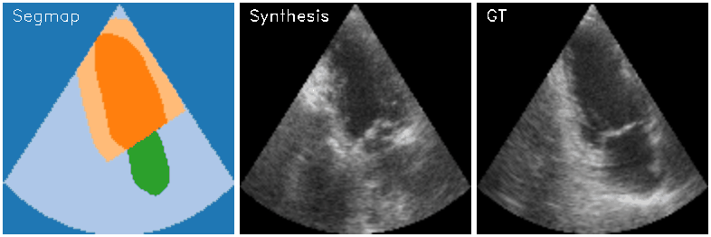

# Echocardiography video synthesis from end diastolic semantic map via diffusion model

Official implementation of the paper "Echocardiography video synthesis from end diastolic semantic map via diffusion model" (ICASSP 2024).


## Requirements

- Python 3.6+
- PyTorch 1.7.1+
- CUDA 10.1+

## Installation

```bash
git clone
cd echocardiography-video-synthesis
pip install -r requirements.txt
```

## Dataset

### Download
CAMUS dataset can be downloaded from [here](https://www.creatis.insa-lyon.fr/Challenge/camus/databases.html).
You have to extract the dataset in the `data` folder. which have the following structure:

```

camus
├── images
│   ├── patient0001
│   │   ├── 0000.png
│   │   ├── 0001.png
│   │   ├── ...
│   │   └── 0020.png
│   ├── patient0002
│   │   ├── 0000.png
│   │   ├── 0001.png
│   │   ├── ...
│   │   └── 0020.png
│   ├── ...
│   └── patient0020
│       ├── 0000.png
│       ├── 0001.png
│       ├── ...
│       └── 0020.png
├── seg_maps_cone
│   ├── patient0001
│   │   ├── 0000.png
│   │   ├── 0001.png
│   │   ├── ...
│   │   └── 0020.png
│   ├── patient0002
│   │   ├── 0000.png
│   │   ├── 0001.png
│   │   ├── ...
│   │   └── 0020.png
│   ├── ...
│   └── patient0020
│       ├── 0000.png
│       ├── 0001.png
│       ├── ...
│       └── 0020.png
├── train.txt
├── val.txt
└── test.txt

```
The dataset does not contain the semantic maps for cone, add them would significantly increase stability of synthesis video. I have provided the semantic maps for the train and test set in the `data` folder. You can also generate them by yourself using the `generate_semantic_maps.py` script.

# Training

```bash
python train.py --data_dir data/camus 
```

# Sampling

```bash
python sample.py --data_dir data/camus --checkpoint_path checkpoints/checkpoint.pth --output_dir samples
```

I have provided the pretrained model in the `checkpoints` folder. You can also train your own model using the `train.py` script.

# Disclaimer

In comparison to the original paper, I have changed the codebase to Karras et al. [1] diffusion model, which provides more efficient sampling. Therefore, the results are not exactly the same as in the paper.

# References

[1] Karras, T., Aittala, M., Aila, T., & Laine, S. (2022). Elucidating the design space of diffusion-based generative models. Advances in Neural Information Processing Systems, 35, 26565-26577.

# Citation

If you find this code useful for your research, please cite our paper:

```
@inproceedings{van2023echocardiography,
  title={Echocardiography video synthesis from end diastolic semantic map via diffusion model},
  author={Phi, Nguyen Van and Duc, Tran Minh and Hieu, Pham Huy and Long, Tran Quoc},
  booktitle={ICASSP 2024-2024 IEEE International Conference on Acoustics, Speech and Signal Processing (ICASSP)},
  year={2024}
}
```

# Acknowledgements

This code is based on the [Video Diffusion Model](https://github.com/lucidrains/video-diffusion-pytorch)